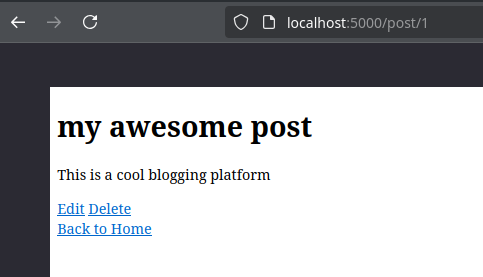

# HC-OpenBlog

A free open blogging platform. Written in python and flask
It uses html for the frontend

Features login/register, post blogs, edit, delete

## How to use

Simple. Just clone the repo:
1. `python3 -m venv venv` create the venv
2. `pip install -m requirements.txt` install the requirements
3. `python3 app.py` run it

## IMages

